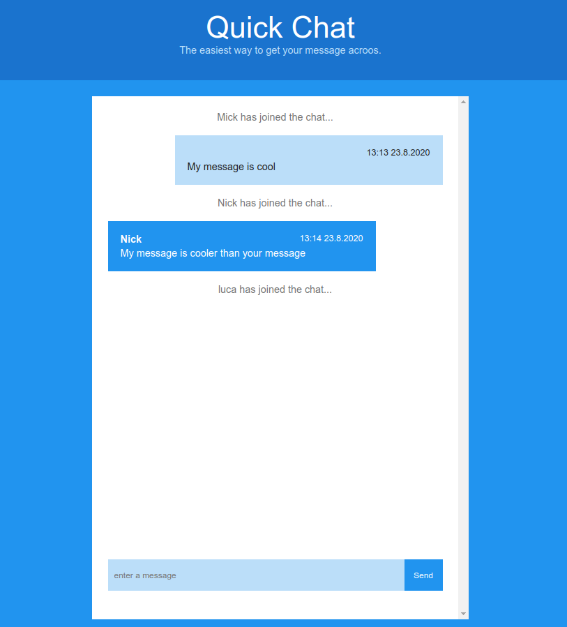

# Just chat

## Introduction
This is just a local chat.
Open the chat app in different browsers and chat with yourself - very useful!

## How to use
After cloning this repo, you need to use the following commands:
### npm install
### npm start
Open [http://localhost:3000] in your browser, write your name and write a message.
